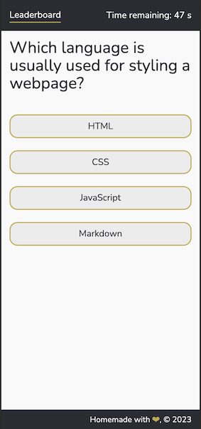
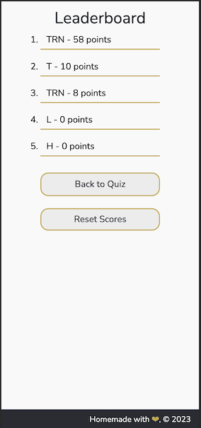
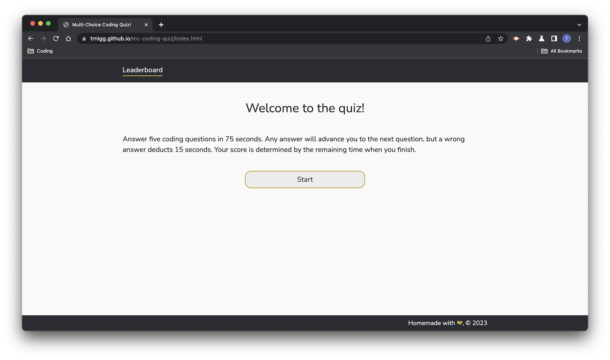
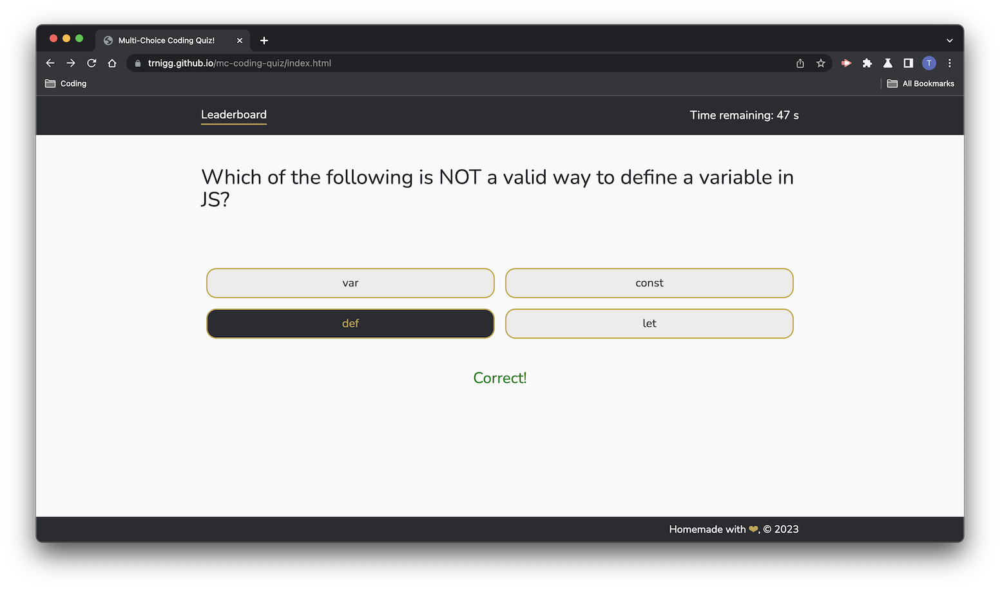
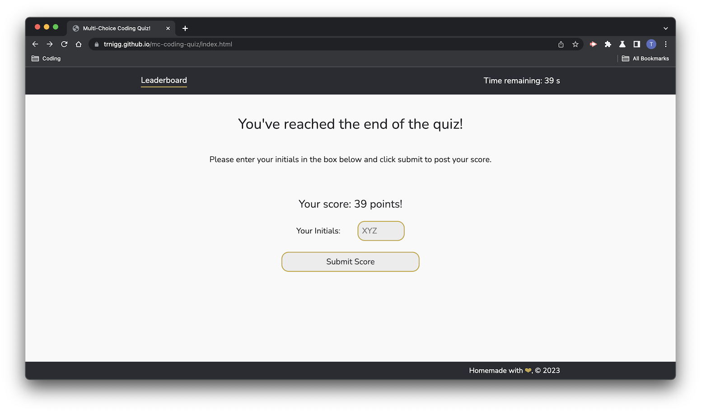
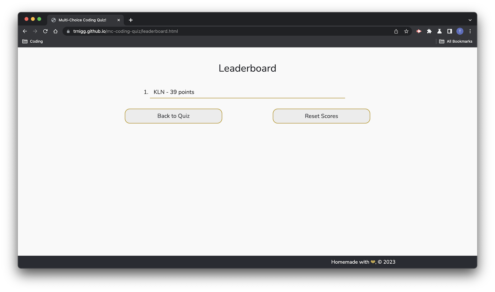

# Multi-Choice Coding Quiz 
(```mc-coding-quiz``` - Module 4 Challenge)

## Description

- The goal of this project was to create an interactive, timed multi-choice coding quiz with a scoring system.
- This was achieved by building a basic webpage from scratch using HTML, CSS, and JavaScript.
- The quiz also features a scoring system (relying on localStorage) and a seperate "leaderboard" page where scores can be viewed or cleared.
    - A second set of scripts was used to handle the leaderboard page, while one CSS sheet handles styling for both the quiz and the leaderboard page.
- This application was primarily designed for use on desktop, but a breakpoint and styling was implemented to allow for good user-experience on mobile devices.
    - See the screenshots below:

### Mobile Appearance:



### Desktop Appearance:
Screenshots below under **Installation/Usage** include instances of the desktop view.

## Installation/Usage

- Please visit the deployed page at: <a href="https://trnigg.github.io/mc-coding-quiz/">trnigg.github.io/mc-coding-quiz/</a> 
- The user will be met with a welcome screen containing instructions, and a 'Start' button.

- Once 'Start' button is clicked, the user will be show five questions sequentially, while a timer runs down from 75 seconds (visible in the top-right corner).
    - After selecting an answer, the quiz will pause the timer for 2 seconds and provide feedback with "Right" or "Wrong", before moving to the next question and resuming the timer.
    - For every wrong answer, 15 seconds is deducted from the time.
 

- Once every question is answered, or the user runs out of time, an end screen is shown were the user is required to enter their initials and submit their score.
 

- After submitting score, the user is taken to a 'Leaderboard' page and show a list of scores in descending order of previous items on the user's browser (scores are only pulled from local storage).
    -   From there, the user can also use one of two buttons to either go 'Back to Quiz' and start again, or to 'Reset Scores' which removes scores from local storage.



## Known Issues
- Currently an issue still persists on touch devices where when list-items containing quiz items are clicked, hover-state formatting applies to them and carries over to the next set of answers.
    - This has been documented in GitHub Repo Issue (#19), and will be addressed in the future.

## Credits

- N/A

## License

MIT License.

Please refer to the license section in the repo for further information.
